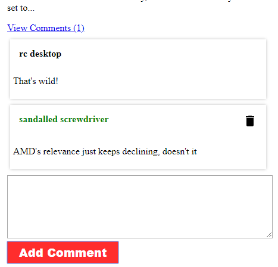

# TechScraper

### Overview

[View deployed version](https://techscraper-rc.herokuapp.com/)

News articles are acquired through parsing the HTML source of https://www.anandtech.com and saving the results to a Mongo database.  Visiting the root directory of the project site triggers the "scraping" function and generates a new user account.  The user ID is stored in a cookie on the user's machine.  As the project focus is the use of Mongoose models and MongoDb, there is presently no authentication system and if the user deletes their cookies, there is no account recovery.

A random username is generated and can be changed by clicking anywhere in the username section, setting the desired username and then clicking anywhere outside of the input box.

Users can leave comments on any article and can delete their own comments

### Technical Details

The application is built in Node using *Express* for route handling, *Mongoose* for database models, and *Express-Handlebars* for server-side rendering.

*Axios* gets the HTML source of the target site and then *Cheerio* is used to select the key article details.  Only new articles (those that don't already exist in the database) are saved and only the five most recent results are pulled to render the home page.  Each subsequent page is limited to five results.

*Sentencer* is used to generate a random string for the initial username given to each visitor.  *Sanitize-HTML* helps prevent the insertion of script tags in usernames and comments.

Comments are not loaded automatically, but the length of the "Comments" array on the Article model is used to indicate whether a user has already left a comment.  The GET request for comments is the only route that uses client-side rendering.

